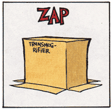

# `transmogrify`

This is a weird little crate for authors of proc macros (or build.rs scripts)
with an uncommon need: it lets you take **values** you're working with in
code-generation and emit code that produces those **values**. In other words,
it *transmogrifies* a value in *codegen-space* into *code-space*.

<p align="center">
  
</p>

Why would I want such a thing? Let's say your macro allows users to express a
value for some type in an alternate format--json, say. The macro might do
something as simple as using `serde` to deserialize the json into the target
type. You might additionally do some error checking or validation to produce
helpful messages for the user.

But now you have the value in *codegen-space*. To get it into *code-space* you
need to turn it into the tokens that produce the value. This is precisely the
`Transmogrify` trait does.

```rust
use transmogrify::Transmogrify;

#[derive(Transmogrify)]
#[transmogrify(prefix = my_crate_name)]
pub struct MyStruct {
    // ...
}

let value = MyStruct {};
let tokens: proc_macro2::TokenStream = value.transmogrify();
```

## Deriving `Transmogrify`

The `Transmogrify` derive macro **requires** the presense of an attribute of
the form `#[transmogrify(prefix = <path>)]` where the `path` is the path-prefix
to the type on which you're deriving `Transmogrify`. This should be the "good",
consumer-visible path to the type that users of your crate would use. (Note
that we don't use `std::any::type_name` because that may produce a path that
contains mods that are inaccessible to crate consumers.)